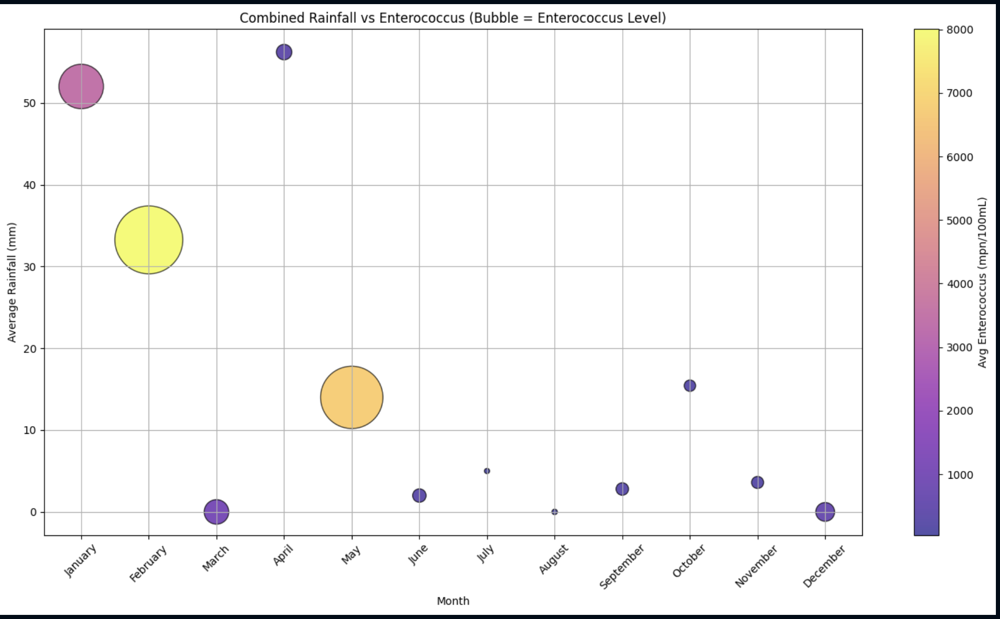
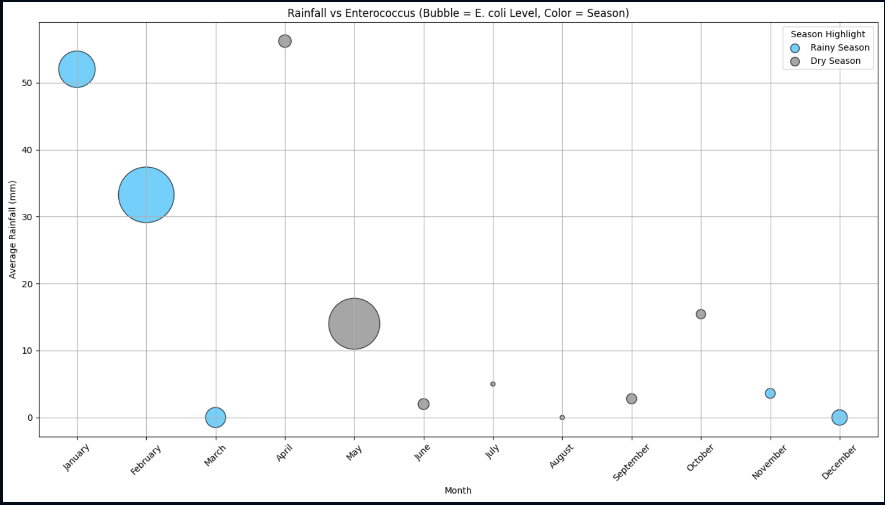

# (SPICE)E-Coli-After-the-Rain
Data analytics project exploring correlations between rainfall, tourism, and coastal E. coli concentrations on Oʻahu. Demonstrates data cleaning, exploratory data analysis, visualization, and statistical analysis using publicly available environmental and tourism datasets.

<h2 align="center">Dashboard Preview</h2>

  
  
